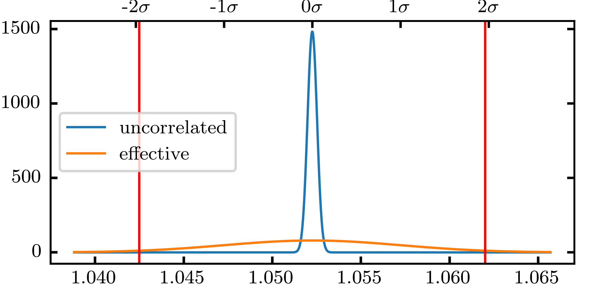


As someone who runs many large-ish unsteady flow simulations, I am often confronted with the question of statistical convergence and simulation runtime. How long do I need to run a complex turbulent simulation for? I typically want to infer something from the temporal statistics such as mean or variance, how realiable are those if I have simulated a certain physical time period?

Common best practice advice ranges from "run 20, 30, 100 of some simple characteristic time unit" to "just make sure the signal mean stays within +- $$1\%$$ over the last couple time steps". Such methods may actually achieve satisfactory results when the time scales in question are selected appropriately. Still, generally we shoot for longer run times when in doubt.

Usually, some form of spectral analysis is part of the postprocessing of the acquired data. For spectral analysis of temporal signals we have simple and handy criteria for the sampling rate and the signal length:

* What is the highest frequency we want to resolve? The Nyquist criterion sets the bounds here, simply stating that our sampling frequency $$f_s$$ should be at least twice the desired highest resolvable frequency

* What is the lowest frequency we want to resolve? For an FFT-based analysis, the width of the frequency bins will be $$f_s/N$$, where $$N$$ is the number of samples. This also determines the lowest resolvable frequency.

Short, in terms of frequency resolution there is no such thing as a too long simulation run. However, increasing the length becomes a rather expensive endeavor pretty quickly. There are quite a few publications focusing on statistics convergence, but it is rather telling that so many of the latter focus on experimental data such as hotwire signals. So I went about asking myself: how accurate are the statistics from my high-$$f_s$$, probably-too-short CFD simulations?

# Estimation of statistic accuracy
Any sample statistic from a measurement or simulation, be it mean, variance or any higher order statistic, can be considered an estimate of a population statistic. The expected value for that statistic is usually unknown, since the entirety of the population is unknown. For instance, if we are interested in a mean we take a sample of size $$N$$ and compute its artithmetic average. No matter the distribution of the population, if we take many samples of size $$N$$ their means will be normally distributed. In order to quantify the reliability of that estimate we could compute the standard error of that estimate, which is $$SE = \sigma / \sqrt{N}$$. Here, $$\sigma$$ is the standard deviation of the population, or in the case of a simulation result, of the temporal signal. $$SE$$ is then the standard deviation of the **estimator of the population mean**.

The concept of standard error and can be extended to different estimators of statistical moments. Note that most of the literature concerning this focuses on the variance of the estimator, which is simply $$\sigma_e^2 = SE^2$$ in the case of the mean.

The sample distribution will have a certain mean and standard deviation, which means we can define a confidence interval - a very useful construct in this case. 
The width of the confidence interval is proportional to $$\sigma_e$$ (or $$SE$$). If we want to improve the quality of our estimate we should aim to reduce SE, and with that the width of the CI. From this follows intuitively that a larger sample size with higher $$N$$ leads to more accurate statistics.

# Effective samples
However, when looking at results from a highly resolved CFD simulation, $$N$$ can become very large. If we talk about temporal sample sizes on the order of $$10^4$$ or $$10^5$$, the resulting high $$N$$ leads to extremely narrow confidence intervals. Great for estimating statistics, right?

The crux of the matter is that such results may be significantly autocorrelated. Using the number of temporal samples as $$N$$ amounts to assuming uncorrelated data, which is simply incorrect. Correlated data points can be thought of as being worth less than uncorrelated data points in a statistical sense, as they hold less new information about the process. In order to be able to use the definition of standard error above, we need to find a proper $$N$$ that corrects this. An effective number of samples $$N_{\mathrm{eff}}$$ can be derived, which characterizes autocorrelated processes by taking into account the interdependence between neighboring samples.

As an example, we look at a signal consisting of 13500 samples. Its mean is $$\mu=1.0522$$, its variance $$\sigma^2=0.001$$. Assuming $$N=13500$$, we obtain a narrow distribution of the sample mean, i.e. the error variance of the mean is very low:

<!---->

We estimate the effective number of samples $$N_{\mathrm{eff}}$$ via the integral time scale of the process
